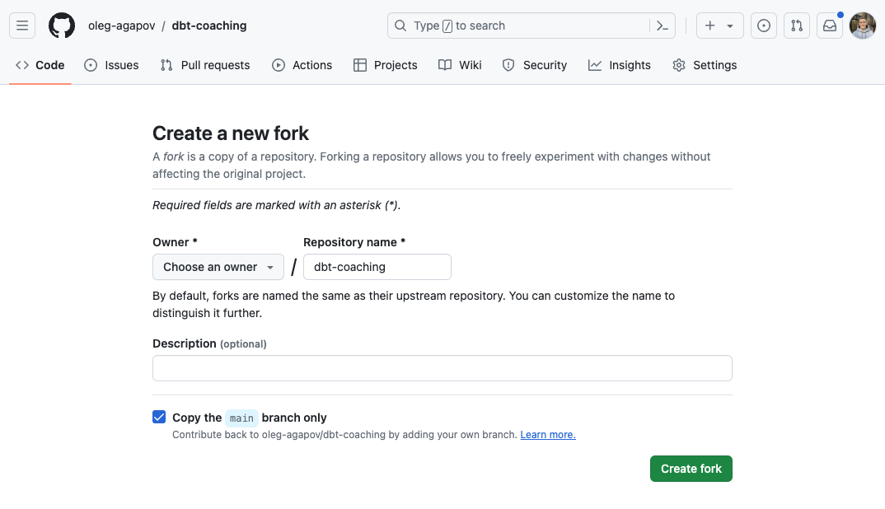
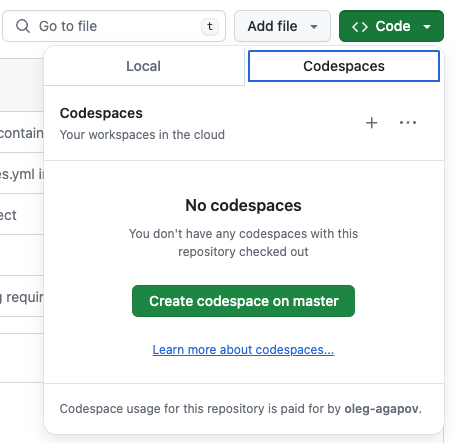
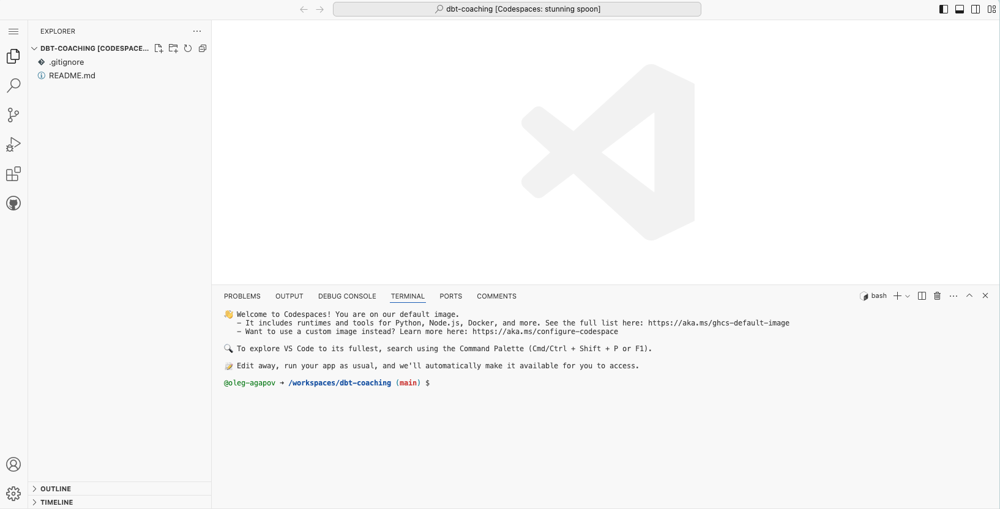

#  dbt coaching

## Getting started with the repo

Before working on the repo, you need to fork it. On the top right corner click "Fork" button.

Then click "Create fork":

Once you have your own copy of the repo, you can create a Codespace – a virtual machine where you can write your own code.

Click on "Code" -> "Codespaces" -> "Create codespace on master (or main)":

After some time, you should see a VSCode editor with the started code:

