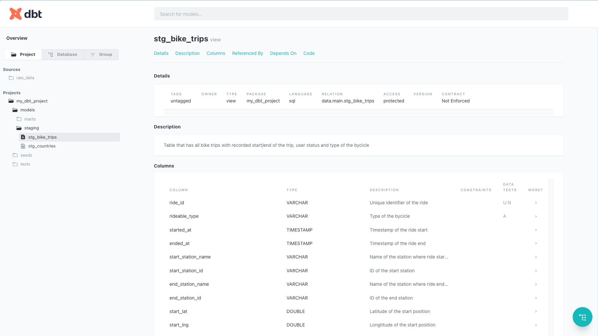

# Practice 2

## Plan

We continue working on the project from the previous session. This time we will do project refactoring, add tests and documentation to our models.

1. 🧱 Refactor models
1. ✏️ Add model YAMLs
1. 🧪 Add tests
1. 📚 Add documentation

## Refactor models

Let's refactor our models according to the best practices recommended by dbt Labs.

To do that we need to create three layers of our models – staging, intermediate and marts.

Next, we could rename existing to better reflect their layer and purpose.

First, let's create 3 new subfolders in `/models`:
- `/models/staging`
- `/models/int`
- `/models/marts`

Now we can rename existing models and put them to the appropriate folders:

- `all_countries.sql` -> `/staging/stg_countries.sql` – staging model for countries seed file
- `all_trips.sql` -> `/staging/stg_bike_trips.sql` – staging models for `bike_trips` raw table
- `bike_stations.sql` -> `/marts/dim_stations.sql` – mart table for bike stations
- `daily_trips.sql` -> `/marts/fact_faily_trips.sql` – mart table for daily trips metrics

Also, let's put `sources.yml` file to `/staging` folder since it is a place where we define mapping from source tables to staging models.


Before running `dbt run` you need to first fix models references in the models, othewise you get errors about missing dependencies.

> Getting an error when trying `dbt run`? Check that you have activated Python's virtual environment (`source venv/bin/activate`) and that you are running the command from `/my_dbt_project folder` (do `cd /my_dbt_project` for that).

**What's next**?

You could go and implement additional models to have better analytics model. For example, you could add two new models:

- `/marts/dim_countries.sql` to create a dimention for countries, because right now such model only exists in staging layer, that is not exposed to end-users and BI tools
- `/marts/fact_bike_trips.sql` model that exposed entity-grainer trips on a mart level
- think about potential intermediate models you could add to the project

## Add model YAMLs

Let's add model YAMLs to our project so that we can define tests and documentation for them.

First, let's describe our staging models. Create a file schema.yml in /models/staging with the followwing content:

```yaml
models:
  - name: stg_bike_trips
    columns:
      - name: ride_id
      - name: rideable_type
      - name: started_at
      - name: ended_at
      - name: start_station_name
      - name: start_station_id
      - name: end_station_name
      - name: end_station_id
      - name: start_lat
      - name: start_lng
      - name: end_lat
      - name: end_lng
      - name: member_casual
  
  - name: stg_countries
    columns:
      - name: iso_code
      - name: latitude
      - name: longitude
      - name: country_name
```

This is a barebone structure that will help us define tests and documentation. For now we only described models we have and their columns.

Now let's do the same with marts models, but with one difference. For each model we will create a separate YAML file.

First file is gonna be `_dim_stations.yml`:

```yaml
models:
  - name: dim_stations
    columns:
      - name: station_id
      - name: station_name
```

Second file is `_fact_daily_trips.yml`:

```yaml
models:
  - name: fact_daily_trips
    columns:
      - name: trip_date
      - name: rideable_type
      - name: member_casual
      - name: trips
```

There is no hard rule when to split one YAML file into smaller files per model. This should be defined within the team and strictly followed going forward.

If you have more models implemented, go ahead and add YAML files for them as well.

## Add tests

With YAML files in place we can start implement data tests.

As usual, let's start with staging models. Let's add a couple of generic tests to `/staging/schema.yml`:

```yaml
models:
  - name: stg_bike_trips
    columns:
      - name: ride_id
        tests:
          - not_null
          - unique
      - name: rideable_type
        tests:
          - accepted_values:
              values: ['electric_bike', 'classic_bike']
      ...
      - name: member_casual
        tests:
          - accepted_values:
              values: ['member', 'casual']
  
  - name: stg_countries
    columns:
      - name: iso_code
        tests:
          - not_null
          - unique
      ...
```

To check tests you should run `dbt test` command.

Also, let's add a singular dbt test that is defined as a regular SQL statement.

Create file `stg_bike_trips__proper_dates.sql` in `/tests` folder:

```sql
select *
from {{ ref('stg_bike_trips') }}
where started_at > ended_at
```

This test will check that now trip is ended before it is actually started (remember, dbt tests should return failed rows to work properly).

Singular tests run with the same `dbt test` command. Also, test command support node selection syntax, so you can run only tests for a specific model like this:

```bash
dbt test -s stg_bike_trips
```

**What to do next**?

- try to add mode tests, for example for marts models
- try to simulate failed tests, for example remove one value from the `accepted_values` test and see the test failing

## Add documentation

Final piece we can add to our models is the documentation.

It's added to the same YAML files we've made earlier. To each model and each column we could add `description` parameter where we could add additional information about the entity.

Let's start with staging layer:

```yaml
models:
  - name: stg_bike_trips
    description: Table that has all bike trips with recorded start/end of the trip, user status and type of the bycicle
    columns:
      - name: ride_id
        description: Unique identifier of the ride
      - name: rideable_type
        description: Type of the bycicle
      - name: started_at
        description: Timestamp of the ride start
      - name: ended_at
        description: Timestamp of the ride end
      - name: start_station_name
        description: Name of the station where ride started
      - name: start_station_id
        description: ID of the start station
      - name: end_station_name
        description: Name of the station where ride ended
      - name: end_station_id
        description: ID of the end station
      - name: start_lat
        description: Latitude of the start position
      - name: start_lng
        description: Longtitude of the start position
      - name: end_lat
        description: Latitude of the end position
      - name: end_lng
        description: Longtitude of the end position
      - name: member_casual
        description: Type of the user (member or casual rider)
  
  - name: stg_countries
    description: Table with ISO codes for countries
    columns:
      - name: iso_code
        description: Country ISO code
      - name: latitude
        description: Latitude of the country
      - name: longitude
        description: Longtitude of the country
      - name: country_name
        description: Full name of the country
```

Now you can preview live docs. First, generate documentation page with:

```bash
dbt docs generate
```

(You should see files appeared/updated in `/target` folder)

Now you can preview them with:

```bash
dbt docs serve
```

(You may need to click "Open in browser" button if docs weren't opened)

When you see a welcome page of dbt docs, you can start exploring them.


Click on bottom right button to see the full graph (DAG):


Next open a model that has description to see the result:



**What's next**?

- add descriptions to the res of the models
- to see updates in the docs, you need to stop currently running docs (with `CTRL+C`), then regenerate then once again and fresh serve
